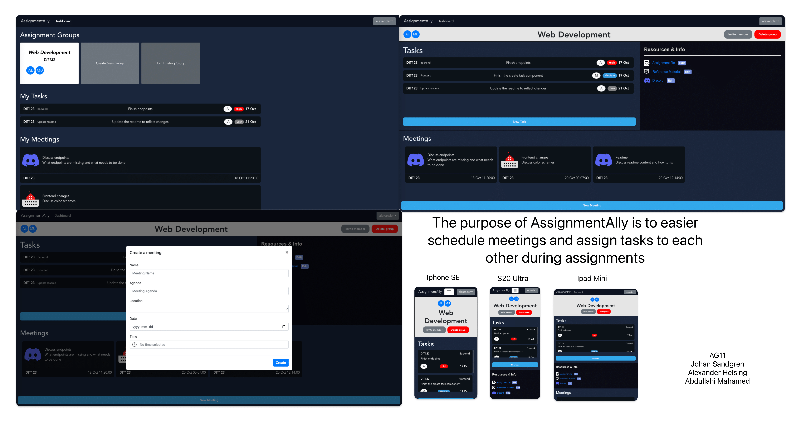

### Purpose

Our app allows you to effortlessly organize your assignments by creating dedicated groups for each project(assignmentGroup), ensuring all pertinent information is at your fingertips. Inside these assignment groups, you can schedule meetings at your convenience, whether it's via Zoom or on campus rooms for in-person discussions.
You can assign tasks to other members in your group, for example "member X shall complete this part of the assignment" and prioritise the tasks with labels.
Each group stores all resources that could be nessesary, diagram links, assignment pdf, links to discord and so forth.
The current user then has a dashboard allowing him to see everything thats on the agena for every group he is currently apart of.

### Pages

- Login page for users to authorise themselves
- Dashboard: A page allowing current user to see an overview on all his ongoing assignments, including all meetings and tasks assigned to him, with options to CRUD groups, meetings and tasks.
- Assignment(group page): A page for each assignment, allowing the user to see all the information about the assignment, including all meetings, tasks, resources and members.

### Technologies Used
- Javascript
- Node.js
- Express.js
- Vue.js
- Bootstrap

### Entity-Relationship (ER) Diagram

## Teaser (MS3)

